# Building Smart Document Retrieval: Chunking & BM25 Search

A comprehensive guide to implementing intelligent document chunking and search for LLM applications.

## Table of Contents

1. [The Problem](#the-problem)
2. [Solution Overview](#solution-overview)
3. [Understanding Chunking](#understanding-chunking)
4. [Understanding BM25 Search](#understanding-bm25-search)
5. [Implementation Deep Dive](#implementation-deep-dive)
6. [Configuration Options](#configuration-options)
7. [Building Your Own](#building-your-own)

---

## The Problem

When working with Large Language Models (LLMs) like Claude, you face a fundamental constraint: **context window limits**. Even with large context windows (200K+ tokens), loading entire documents can:

1. **Exceed context limits** - Long videos can have 50K+ word transcripts
2. **Waste tokens** - Most of the content may be irrelevant to the user's question
3. **Reduce quality** - LLMs perform better with focused, relevant context
4. **Increase costs** - More tokens = higher API costs

```mermaid
flowchart LR
    A[📹 2-hour Video] --> B[50,000 words]
    B --> C[~65,000 tokens]
    C --> D{Context Window}
    D -->|Exceeds Limit| E[❌ Error]
    D -->|Fits but Wasteful| F[💸 High Cost]
```



### Real-World Example

A 2-hour YouTube video transcript might contain:
- ~15,000 words (short video) → ~20K tokens ✅ Fits
- ~50,000 words (long video) → ~65K tokens ⚠️ Risky
- ~100,000 words (very long) → ~130K tokens ❌ Too large

---

## Solution Overview

We solve this with a **three-tier approach**:


### The Flow


---

## Understanding Chunking

### What is Chunking?

Chunking is dividing a large document into smaller, manageable pieces. For video transcripts, we use **time-based chunking** since we have timestamp data.


### Types of Chunking

| Method | Description | Best For |
|--------|-------------|----------|
| **Fixed Size** | Split every N characters | Simple text documents |
| **Time-Based** | Split by timestamps | Video/audio transcripts |
| **Semantic** | Split by topic/meaning | Articles, books |
| **Sentence** | Split at sentence boundaries | Chat logs, Q&A |

### Our Implementation: Time-Based Chunking

We use the transcript's timecode data to create precise time-based chunks:

```typescript
interface TimecodeEntry {
  start: number;    // Start time in milliseconds
  end: number;      // End time in milliseconds
  text: string;     // The spoken text
  duration: number; // Duration in milliseconds
}

// Example timecode entry
{
  start: 45000,      // 0:45
  end: 48500,        // 0:48.5
  text: "neural networks are mathematical models",
  duration: 3500
}
```

#### The Chunking Algorithm

```typescript
function createSegments(
  timecodes: TimecodeEntry[],
  segmentDurationMs: number  // e.g., 300000 (5 minutes)
): Segment[] {
  const segments: Segment[] = [];
  let currentSegment: TimecodeEntry[] = [];
  let segmentStartTime = timecodes[0].start;

  for (const entry of timecodes) {
    const segmentEndTime = segmentStartTime + segmentDurationMs;

    if (entry.start < segmentEndTime) {
      // Entry belongs to current segment
      currentSegment.push(entry);
    } else {
      // Save current segment, start new one
      segments.push({
        text: currentSegment.map(e => e.text).join(' '),
        startTime: segmentStartTime,
        endTime: currentSegment[currentSegment.length - 1].end,
      });

      segmentStartTime = entry.start;
      currentSegment = [entry];
    }
  }

  // Don't forget the last segment!
  if (currentSegment.length > 0) {
    segments.push({...});
  }

  return segments;
}
```

#### Visual Example


---

## Understanding BM25 Search

### What is BM25?

**BM25 (Best Match 25)** is a ranking algorithm used by search engines. It's the successor to TF-IDF and is used by Elasticsearch, Lucene, and many other search systems.

### The Intuition

BM25 answers: **"How relevant is this document to the search query?"**

It considers three factors:


### Term Frequency (TF)

**Intuition**: If a word appears more often, the document is probably more relevant.

But there's a catch: **diminishing returns**. Mentioning "neural" 10 times isn't 10x more relevant than mentioning it once.


### Inverse Document Frequency (IDF)

**Intuition**: Rare words are more informative than common words.

| Word | Appears In | IDF Score |
|------|-----------|-----------|
| "the" | 100% of segments | ~0 (useless) |
| "learning" | 50% of segments | Low |
| "backpropagation" | 5% of segments | High (specific!) |

```typescript
// IDF Formula
function calculateIDF(
  totalDocs: number,      // Total number of segments
  docsWithTerm: number    // Segments containing this term
): number {
  // BM25 IDF formula
  return Math.log(
    (totalDocs - docsWithTerm + 0.5) / (docsWithTerm + 0.5) + 1
  );
}
```

### Document Length Normalization

**Intuition**: A long segment mentioning "neural" once might be less relevant than a short segment mentioning it once.

Without normalization:
- Long segment (1000 words) with 2 mentions → score: 2
- Short segment (50 words) with 2 mentions → score: 2 (same!)

With normalization:
- Long segment → score adjusted down
- Short segment → score remains high (more focused!)

### The Complete BM25 Formula

```
Score = Σ IDF(term) × (tf × (k1 + 1)) / (tf + k1 × (1 - b + b × docLen/avgDocLen))
```

Where:
- `tf` = term frequency in document
- `k1` = term frequency saturation parameter (typically 1.2-2.0)
- `b` = length normalization parameter (typically 0.75)
- `docLen` = document length (word count)
- `avgDocLen` = average document length

### Implementation

```typescript
function bm25Score(
  segmentTokens: string[],    // Words in the segment
  queryTokens: string[],      // Words in the search query
  idf: Map<string, number>,   // Pre-calculated IDF values
  avgDocLength: number,       // Average segment length
  k1 = 1.5,                   // Saturation parameter
  b = 0.75                    // Length normalization
): number {
  const docLength = segmentTokens.length;
  let score = 0;

  // Count term frequencies in segment
  const tf = new Map<string, number>();
  for (const token of segmentTokens) {
    tf.set(token, (tf.get(token) || 0) + 1);
  }

  // Score each query term
  for (const term of queryTokens) {
    const termFreq = tf.get(term) || 0;
    const termIdf = idf.get(term) || 0;

    if (termFreq > 0) {
      // BM25 scoring formula
      const numerator = termFreq * (k1 + 1);
      const denominator = termFreq + k1 * (1 - b + b * (docLength / avgDocLength));
      score += termIdf * (numerator / denominator);
    }
  }

  return score;
}
```

### Search Flow


---

## Implementation Deep Dive

### File Structure

```
server/src/mcp/tools/
├── get-transcript.ts      # Chunking + auto-load logic
├── search-transcript.ts   # BM25 search implementation
└── fetch-transcript.ts    # Initial fetch + metadata
```

### Auto-Load Logic

The `get_transcript` tool decides whether to load everything or return a preview:

```typescript
// Simplified logic
async function handleGetTranscript(args) {
  const transcript = await findTranscript(args.videoId);
  const fullText = transcript.fullTranscript;

  // Decision tree
  if (args.startTime || args.endTime) {
    // User requested specific time range
    return getTimeRange(transcript, args.startTime, args.endTime);
  }

  if (args.chunkIndex !== undefined) {
    // User requested specific chunk
    return getChunk(transcript, args.chunkIndex, args.chunkSize);
  }

  if (args.includeFullTranscript || fullText.length <= maxFullTranscriptLength) {
    // Small enough to auto-load OR explicitly requested
    return { transcript: fullText, note: 'Full transcript loaded' };
  }

  // Too large - return preview with hints
  return {
    preview: fullText.substring(0, 500) + '...',
    usage: {
      search: 'Use search_transcript to find relevant portions',
      chunks: 'Use chunkIndex to paginate',
      timeRange: 'Use startTime/endTime for specific portions'
    }
  };
}
```


### Search Implementation

```typescript
async function handleSearchTranscript(args) {
  const { videoId, query, maxResults = 5 } = args;

  // 1. Get transcript with timecodes
  const transcript = await findTranscript(videoId);
  const timecodes = transcript.transcriptWithTimeCodes;

  // 2. Create searchable segments (30-second chunks)
  const segments = createSegments(timecodes, 30 * 1000);

  // 3. Tokenize query
  const queryTokens = tokenize(query);
  // "neural networks" → ["neural", "networks"]

  // 4. Calculate IDF for query terms
  const vocabulary = new Set(queryTokens);
  const idf = calculateIDF(segments, vocabulary);

  // 5. Calculate average document length
  const avgDocLength = segments.reduce(
    (sum, seg) => sum + tokenize(seg.text).length, 0
  ) / segments.length;

  // 6. Score all segments
  const scored = segments.map(segment => ({
    ...segment,
    score: bm25Score(
      tokenize(segment.text),
      queryTokens,
      idf,
      avgDocLength
    )
  }));

  // 7. Return top results
  return scored
    .filter(s => s.score > 0)
    .sort((a, b) => b.score - a.score)
    .slice(0, maxResults);
}
```

### Tokenization

Simple but effective tokenization:

```typescript
function tokenize(text: string): string[] {
  return text
    .toLowerCase()                    // Normalize case
    .replace(/[^\w\s]/g, ' ')        // Remove punctuation
    .split(/\s+/)                     // Split on whitespace
    .filter(word => word.length > 1); // Remove single chars
}

// Example
tokenize("Hello, World! How's it going?")
// → ["hello", "world", "how", "it", "going"]
```

---

## Configuration Options

All options are configurable via Strapi plugin config:

```typescript
// config/plugins.ts
export default {
  'yt-transcript-strapi-plugin': {
    enabled: true,
    config: {
      // Proxy for YouTube requests (if needed)
      proxyUrl: process.env.PROXY_URL,

      // Chunking: size of each chunk for pagination
      chunkSizeSeconds: 300,  // 5 minutes

      // Preview: characters shown when content is too large
      previewLength: 500,

      // Auto-load: threshold for automatic full loading
      // ~50K chars ≈ 12K tokens, safe for most LLMs
      maxFullTranscriptLength: 50000,

      // Search: segment size for BM25 scoring
      // Smaller = more precise, larger = more context
      searchSegmentSeconds: 30,
    },
  },
};
```

### Tuning Tips

| Setting | Lower Value | Higher Value |
|---------|-------------|--------------|
| `chunkSizeSeconds` | More chunks, finer control | Fewer chunks, more context per chunk |
| `maxFullTranscriptLength` | Safer, more preview mode | More auto-loading, risk of overflow |
| `searchSegmentSeconds` | More precise matches | More context per result |

---

## Building Your Own

### Step 1: Define Your Data Structure

First, define how your content is structured:

```typescript
interface YourDocument {
  id: string;
  content: string;
  // Add any metadata you have (timestamps, sections, etc.)
  sections?: Array<{
    title: string;
    content: string;
    startPosition: number;
  }>;
}
```

### Step 2: Implement Chunking

Choose a chunking strategy based on your content:

```typescript
// For text without structure: fixed-size chunks
function chunkBySize(text: string, chunkSize: number): string[] {
  const chunks: string[] = [];
  for (let i = 0; i < text.length; i += chunkSize) {
    chunks.push(text.slice(i, i + chunkSize));
  }
  return chunks;
}

// For structured content: use natural boundaries
function chunkBySections(doc: YourDocument): string[] {
  return doc.sections?.map(s => s.content) || [doc.content];
}

// For transcripts: use timestamps
function chunkByTime(timecodes: TimecodeEntry[], seconds: number): Segment[] {
  // ... implementation shown above
}
```

### Step 3: Implement BM25

Create reusable BM25 utilities:

```typescript
// bm25.ts
export function tokenize(text: string): string[] {
  return text.toLowerCase()
    .replace(/[^\w\s]/g, ' ')
    .split(/\s+/)
    .filter(w => w.length > 1);
}

export function calculateIDF(
  documents: string[],
  vocabulary: Set<string>
): Map<string, number> {
  const idf = new Map<string, number>();
  const N = documents.length;

  for (const term of vocabulary) {
    const docsWithTerm = documents.filter(doc =>
      tokenize(doc).includes(term)
    ).length;

    idf.set(term, Math.log((N - docsWithTerm + 0.5) / (docsWithTerm + 0.5) + 1));
  }

  return idf;
}

export function score(
  docTokens: string[],
  queryTokens: string[],
  idf: Map<string, number>,
  avgLen: number,
  k1 = 1.5,
  b = 0.75
): number {
  const docLen = docTokens.length;
  const tf = new Map<string, number>();

  for (const token of docTokens) {
    tf.set(token, (tf.get(token) || 0) + 1);
  }

  let totalScore = 0;
  for (const term of queryTokens) {
    const termFreq = tf.get(term) || 0;
    if (termFreq > 0) {
      const termIdf = idf.get(term) || 0;
      const num = termFreq * (k1 + 1);
      const denom = termFreq + k1 * (1 - b + b * docLen / avgLen);
      totalScore += termIdf * (num / denom);
    }
  }

  return totalScore;
}
```

### Step 4: Build the Search Function

```typescript
import { tokenize, calculateIDF, score } from './bm25';

export function search(
  documents: Array<{ id: string; text: string }>,
  query: string,
  maxResults = 5
) {
  // Tokenize query
  const queryTokens = tokenize(query);

  // Build vocabulary from query
  const vocab = new Set(queryTokens);

  // Calculate IDF
  const idf = calculateIDF(documents.map(d => d.text), vocab);

  // Calculate average document length
  const avgLen = documents.reduce(
    (sum, d) => sum + tokenize(d.text).length, 0
  ) / documents.length;

  // Score and rank
  return documents
    .map(doc => ({
      ...doc,
      score: score(tokenize(doc.text), queryTokens, idf, avgLen)
    }))
    .filter(d => d.score > 0)
    .sort((a, b) => b.score - a.score)
    .slice(0, maxResults);
}
```

### Step 5: Integrate with Your MCP Tool

```typescript
export const searchTool = {
  name: 'search_documents',
  description: 'Search documents using BM25 ranking',
  inputSchema: {
    type: 'object',
    properties: {
      query: { type: 'string', description: 'Search query' },
      maxResults: { type: 'number', default: 5 }
    },
    required: ['query']
  }
};

export async function handleSearch(args: { query: string; maxResults?: number }) {
  const documents = await getAllDocuments(); // Your data source
  const results = search(documents, args.query, args.maxResults);

  return {
    content: [{
      type: 'text',
      text: JSON.stringify(results, null, 2)
    }]
  };
}
```

---

## Summary


### Key Takeaways

1. **Don't load everything** - Use smart thresholds to decide when to auto-load
2. **Chunk by natural boundaries** - Timestamps, sections, paragraphs
3. **BM25 is simple but powerful** - Just term frequency + IDF + length normalization
4. **Provide navigation hints** - Help the LLM find what it needs
5. **Make it configurable** - Different use cases need different settings

### Further Reading

- [Okapi BM25 on Wikipedia](https://en.wikipedia.org/wiki/Okapi_BM25)
- [Elasticsearch BM25 Guide](https://www.elastic.co/blog/practical-bm25-part-2-the-bm25-algorithm-and-its-variables)
- [MCP Protocol Documentation](https://modelcontextprotocol.io/)
